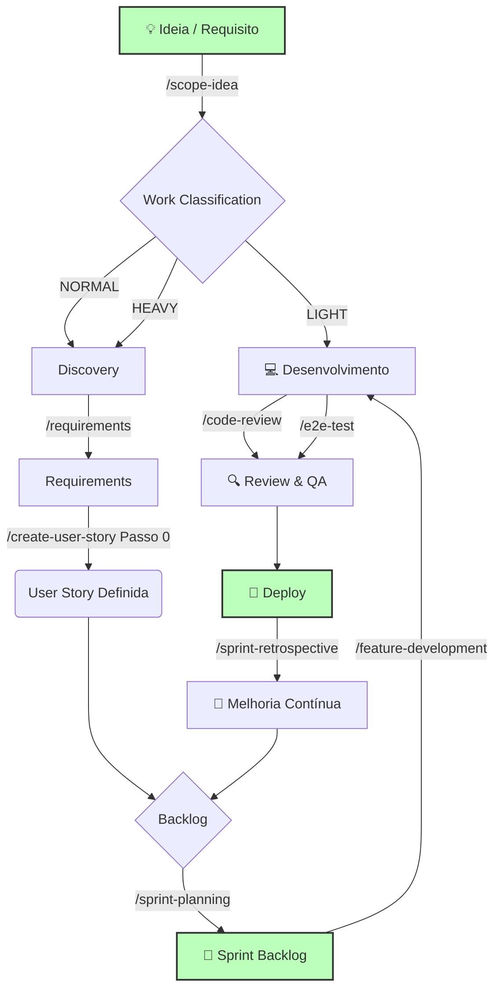

# 🚀 ScrumAIDev Agile Framework

**Desenvolvimento de Software Ágil Potencializado por IA**

> Um framework completo que guia times e agentes de IA ao longo de todo o ciclo Scrum — do refinamento ao deploy.

---

## 🗺️ O Ciclo de Vida Ágil com IA



Para uma ideia nova ou mudança ainda não classificada, `/scope-idea` é a entrada preferencial: ele recomenda LIGHT/NORMAL/HEAVY PROCESS (eixo independente do Token Budget, que também usa LIGHT/NORMAL/HEAVY — veja `docs/token_budget.md`) e, para NORMAL/HEAVY PROCESS, orquestra `/discover` → `/requirements` → `/create-user-story` (Passo 0 — Modo Backlog) antes do Sprint Planning. Para uma User Story já compreendida, `/create-user-story` continua podendo ser usado diretamente. Veja `docs/discovery_requirements.md` e `docs/adr/ADR-002_discovery-requirements-inspirado-no-ai-dlc.md` para o racional completo. Versão em texto do mesmo fluxo: `CONTRIBUTING.md#fluxo-de-trabalho-básico`; ao alterar um, atualize o outro.

---

## ⚡ Quick Start — instalação oficial

> **Importante:** há duas etapas diferentes:
>
> 1. **instalar a CLI `scrumaidev` uma única vez no seu ambiente**;
> 2. **configurar o ScrumAIDev dentro de cada projeto** com `scrumaidev config`.
>
> Você **não** precisa copiar o código-fonte do ScrumAIDev para dentro do seu projeto.

### Pré-requisitos

Para a release `0.3.0`:

- Python compatível com `>= 3.10` (o `uv` pode gerenciar o Python usado pela ferramenta);
- `uv` recomendado, ou `pipx` como alternativa;
- Git recomendado;
- pelo menos um harness instalado para o teste real:
  - OpenCode; ou
  - Codex; ou
  - Claude Code (CLI ou extensão para VS Code); ou
  - Google Antigravity (IDE ou CLI).

Em Windows, para OpenCode, prefira executar **VS Code + WSL/Ubuntu** e instalar também `scrumaidev` dentro do mesmo WSL. Evite misturar CLI do Windows com OpenCode do WSL.

---

### Opção A — instalar a partir do `release-bundle.zip` (recomendado para usuário final)

Acesse o a versão atual disponivel em: https://github.com/profmoisesomena/ScrumAIDev-0.3.0/releases/tag/v0.3.0

Baixe e extraia:

```text
ScrumAIDev-0.3.0-release-bundle.zip
```

Após a extração, você terá pelo menos:

```text
ScrumAIDev-0.3.0-source.zip
scrumaidev-0.3.0-py3-none-any.whl
RELEASE_NOTES_0.3.0.md
VALIDATION_REPORT_0.3.0.md
ScrumAIDev-0.3.0-SHA256SUMS.txt
```

Entre, no terminal, na pasta onde esses arquivos foram extraídos e execute:

```bash
uv tool install --force ./scrumaidev-0.3.0-py3-none-any.whl
```

Se `uv` não estiver instalado, instale-o primeiro ou use `pipx`:

```bash
pipx install --force ./scrumaidev-0.3.0-py3-none-any.whl
```

Confirme a instalação:

```bash
scrumaidev version
scrumaidev adapters
```

Esperado:

```text
0.3.0
```

E os adapters:

```text
antigravity  Google Antigravity        delivery=skills
claude       Claude Code              delivery=skills
codex        OpenAI Codex CLI         delivery=skills
opencode     OpenCode                 delivery=commands+skills
```

> O wheel instala a CLI. O arquivo `ScrumAIDev-0.3.0-source.zip` é destinado a inspeção, desenvolvimento e contribuição; ele não precisa ser copiado para o projeto usuário.

---

### Opção B — instalar a partir do código-fonte

Use esta opção principalmente para desenvolvimento do próprio ScrumAIDev:

```bash
uv tool install --force .
```

Ou os bootstraps do repositório-fonte:

```powershell
.\installer\install.ps1 -Source .
```

```bash
./installer/install.sh .
```

---

### 1. Criar ou abrir o projeto que receberá o ScrumAIDev

Exemplo de projeto novo para teste:

```bash
mkdir -p ~/scrumaidev-tests/test-opencode
cd ~/scrumaidev-tests/test-opencode
git init
```

**Permaneça na raiz desse projeto** para os próximos comandos. É nessa pasta que `AGENTS.md`, `.scrumaidev/`, `.agents/` e o adapter do harness serão instalados.

Você pode confirmar onde está com:

```bash
pwd
```

---

### 2. Verificar o que será instalado sem alterar o projeto

OpenCode:

```bash
scrumaidev config --harness opencode --pin 0.4.0 --dry-run
```

Codex:

```bash
scrumaidev config --harness codex --pin 0.4.0 --dry-run
```

Claude Code:

```bash
scrumaidev config --harness claude --pin 0.4.0 --dry-run
```

Google Antigravity:

```bash
scrumaidev config --harness antigravity --pin 0.4.0 --dry-run
```

Leia o plano. Em um projeto novo, a maior parte das linhas deve aparecer como `create`.

---

### 3. Configurar o projeto

Para OpenCode:

```bash
scrumaidev config --harness opencode --pin 0.4.0
```

Para Codex:

```bash
scrumaidev config --harness codex --pin 0.4.0
```

Para Claude Code:

```bash
scrumaidev config --harness claude --pin 0.4.0
```

Para Google Antigravity:

```bash
scrumaidev config --harness antigravity --pin 0.4.0
```

Depois valide:

```bash
scrumaidev doctor
```

Esperado:

```text
ScrumAIDev doctor — ok
```

Também é útil conferir:

```bash
git status
```

Em OpenCode, devem existir facades em:

```text
.opencode/commands/
```

Em Codex, devem existir skills de workflow em:

```text
.agents/skills/scrumaidev-*/SKILL.md
```

Em Claude Code, devem existir uma rule de projeto e skills em:

```text
.claude/rules/scrumaidev.md
.claude/skills/scrumaidev-*/SKILL.md
```

O adapter Claude **não** cria nem altera `CLAUDE.md` ou `.claude/settings.json`; se o projeto já tiver esses arquivos, eles são preservados.

Em Google Antigravity, devem existir skills de workflow em:

```text
.agents/skills/scrumaidev-*/SKILL.md
```

O adapter Antigravity **não** cria `GEMINI.md`, diretório `.gemini/` nem facades de specialist skills; o Antigravity descobre nativamente `.agents/skills/`, `AGENTS.md` e `.agents/rules/`.

Em todos os casos, os workflows canônicos permanecem em:

```text
.agents/workflows/
```

---

### 4. Fazer o primeiro teste real — OpenCode

Pré-condição: `opencode --version` deve funcionar no mesmo terminal/WSL.

Na raiz do projeto configurado:

```bash
opencode
```

Antes do teste, confirme no OpenCode que o modelo/provider desejado continua ativo. O ScrumAIDev usa `inherit-session-model` e não deve trocar seu provider/model.

Execute um fluxo pequeno, por exemplo:

```text
/scope-idea Quero criar um pequeno sistema para alunos registrarem tarefas de um projeto com título, responsável, status e prazo.
```

Valide especialmente:

1. o agente propõe `LIGHT`, `NORMAL` ou `HEAVY PROCESS`;
2. ele **para no CHECKPOINT C0** e permite revisar a classificação;
3. se a classificação for `NORMAL` ou `HEAVY`, ele conduz Discovery;
4. em Discovery, ele apresenta proposta editável antes de marcar `PROBLEM_READY`;
5. em Requirements, ele apresenta os requisitos completos antes de marcar `REQUIREMENTS_READY`;
6. nenhum gate humano é autoaprovado;
7. o modelo/provider ativo continua o mesmo ao final.

Para um smoke test mínimo, valide pelo menos:

```text
/scope-idea
/discover
/requirements
```

com uma aprovação humana real em um dos gates.

---

### 5. Fazer o primeiro teste real — Codex

Use **outro projeto de teste**, para não misturar adapters durante a primeira validação:

```bash
mkdir -p ~/scrumaidev-tests/test-codex
cd ~/scrumaidev-tests/test-codex
git init
scrumaidev config --harness codex --pin 0.3.0 --dry-run
scrumaidev config --harness codex --pin 0.3.0
scrumaidev doctor
```

Confira as skills ScrumAIDev instaladas:

```bash
find .agents/skills -maxdepth 2 -name SKILL.md | sort
```

Inicie o Codex na raiz do projeto:

```bash
codex
```

E invoque explicitamente a skill:

```text
$scrumaidev-scope-idea Quero criar um pequeno sistema para alunos registrarem tarefas de um projeto com título, responsável, status e prazo.
```

Depois, conforme o fluxo exigir, teste por exemplo:

```text
$scrumaidev-discover
$scrumaidev-requirements
```

Valide os mesmos gates humanos e confirme que o Codex continua usando sua configuração normal de modelo.

---

### 5b. Fazer o primeiro teste real — Claude Code (VS Code)

Use **outro projeto de teste**:

```bash
mkdir -p ~/scrumaidev-tests/test-claude
cd ~/scrumaidev-tests/test-claude
git init
scrumaidev config --harness claude --pin 0.3.0 --dry-run
scrumaidev config --harness claude --pin 0.3.0
scrumaidev doctor
```

Abra a pasta no VS Code (`code .`) e inicie uma **nova** sessão do Claude Code (as skills são descobertas no início da sessão). No painel do Claude Code:

```text
/skills
```

Devem aparecer 13 skills de workflow `scrumaidev-<workflow>` e 9 skills especialistas `scrumaidev-<skill>` (por exemplo `scrumaidev-architect`). As skills de workflow são invocadas apenas por você; as especialistas podem ser usadas pelo Claude quando relevantes.

Execute:

```text
/scrumaidev-scope-idea Quero criar um pequeno sistema para alunos registrarem tarefas de um projeto com título, responsável, status e prazo.
```

Depois, conforme o fluxo exigir:

```text
/scrumaidev-discover
/scrumaidev-requirements
```

Nos documentos canônicos os workflows aparecem como `/scope-idea`, `/discover` etc.; no Claude Code a invocação equivalente é `/scrumaidev-<workflow>` (o mapa está em `.claude/rules/scrumaidev.md`).

Valide os mesmos gates humanos e confirme no seletor de modelo que o modelo ativo não mudou.

> O Claude Code adiciona por padrão um trailer `Co-Authored-By` em commits. A regra 14 do `AGENTS.md` do ScrumAIDev proíbe esse trailer para agentes de IA, e a rule gerada reforça isso. Se quiser desativá-lo também na configuração do Claude Code, ajuste a opção de atribuição em `.claude/settings.local.json` ou nas suas configurações de usuário — o ScrumAIDev não altera esses arquivos.

---

### 6. Registrar uma baseline para comparar os harnesses

Depois que `scrumaidev doctor` retornar `ok`, antes de executar o fluxo agentic, é recomendável registrar uma baseline Git:

```bash
git add .
git commit -m "chore: baseline ScrumAIDev 0.3.0"
```

Assim, depois do teste, você poderá usar:

```bash
git status
git diff
```

para ver exatamente quais artefatos o workflow criou ou alterou.

Para comparação OpenCode × Codex × Claude Code, use a **mesma ideia inicial** nos projetos e registre:

- modelo utilizado;
- tempo;
- número de interações humanas;
- artefatos produzidos;
- aderência aos gates;
- custo/tokens quando houver telemetria no gateway;
- problemas observados.

---

### 7. Diagnóstico e remoção

```bash
scrumaidev version
scrumaidev adapters
scrumaidev doctor --json
scrumaidev uninstall --dry-run
scrumaidev uninstall
```

Por padrão, o uninstall remove apenas arquivos gerenciados que continuam íntegros e preserva artefatos do projeto em `docs/` e `templates/`. Use `--force` somente quando a substituição/remoção de arquivos gerenciados modificados for intencional.

### Harness Adapter API

A arquitetura e o contrato para novos harnesses estão documentados em:

- `docs/harness_adapter_api_v1.md`;
- `docs/harness_capability_matrix.md`;
- `docs/adding_harness_adapter.md`;
- `docs/adr/ADR-003_harness-adapter-api.md`;
- `docs/adr/ADR-004_claude-code-adapter.md`.

## 🤖 Workflows — Guias de Processo por IA

Ative usando slash commands no chat do agente:

| Workflow | Quando usar | O que produz |
|---|---|---|
| `/init-project` | **Início de projeto** | Estrutura de pastas + reconhecimento de contexto |
| `/scope-idea` | **Ideia/mudança nova** | Recomendação LIGHT/NORMAL/HEAVY PROCESS + roteamento para Discovery/Requirements/Stories somente quando necessário |
| `/discover` | **NORMAL/HEAVY PROCESS, entendimento do problema** | `docs/discovery/<slug>.md` editável + gate `PROBLEM READY` |
| `/requirements` | **Estruturar o que precisa ser entregue** | `docs/requirements/<slug>.md` editável + gate `REQUIREMENTS READY` |
| `/sprint-planning` | **Início da sprint** | `docs/sprints/sprint_planning_NN.md` com goal, stories e riscos; na primeira execução também pode gerar ou atualizar `docs/product_backlog.md` |
| `/create-user-story` | **Refinamento** | `docs/stories/US-XXX.md` com critérios INVEST completos |
| `/feature-development` | **Durante a sprint** | Branch + código + testes + PR |
| `/code-review` | **Antes do merge** | Relatório: arquitetura, qualidade, segurança, DoD |
| `/e2e-test` | **Antes do deploy** | Testes Playwright com Page Object Model |
| `/sprint-retrospective` | **Fim da sprint** | `retrospectives/sprint_NN_retro.md` + action items SMART |
| `/deploy` | **Release** | Checklist pré-deploy, smoke tests, tag de release |
| `/integrate-backend` | **Legado** | Análise e plano de integração de sistemas anteriores |
| `/publish-github-planning` | **Pós-planning** | Sincroniza Epics/User Stories/Tasks como GitHub Issues e a sprint ativa como Milestone/Iteration |

---

## 🎭 Skills — Personas da IA

As skills transformam o agente em um especialista para cada contexto. O agente as usa automaticamente conforme o workflow — ou você pode ativá-las explicitamente:

> *"Atue como [nome da skill] e..."*

| Skill | Persona | Especialidade |
|---|---|---|
| `architect` | Arquiteto de Software | Trade-offs, SOLID, Clean Arch, visão sistêmica |
| `backend-python` | Dev Backend Senior | FastAPI/Django, PostgreSQL, Neo4j, Pytest |
| `frontend-vue` | Dev Vue Senior | Vue 3, TypeScript, Vite, Pinia, Composition API |
| `react-expert` | Dev React Senior | React 18+, TypeScript, hooks, custom hooks, testes |
| `qa-engineer` | Engenheiro de Qualidade | Casos de teste, edge cases, validação de critérios |
| `security-expert` | Consultor AppSec | OWASP Top 10, auditoria, modelagem de ameaças |
| `story-refiner` | Product Owner Técnico | User stories INVEST, critérios de aceitação testáveis |
| `technical-writer` | Escritor Técnico | READMEs, API docs, manuais, release notes |
| `skill-creator` | Auxiliar de Meta-Skill | Criar/ajustar skills quando o projeto derivado não tiver uma pronta (uso auxiliar, sob revisão humana) |

---

## 📂 Templates — Artefatos Ágeis Prontos

Copie e preencha — ou peça à IA para preencher por você:

| Template | Propósito | Usado pelo workflow |
|---|---|---|
| `work_classification.md` | Registro editável da classificação LIGHT/NORMAL/HEAVY PROCESS | `/scope-idea` |
| `discovery.md` | Entendimento editável do problema (Intent/Scope/Success Criteria) | `/discover` |
| `requirements.md` | FR/BR/NFR e cenários revisáveis | `/requirements` |
| `product_backlog.md` | Mapa de funcionalidades e roadmap | `/sprint-planning` |
| `sprint_planning.md` | Compromisso da sprint (goal, stories, capacidade) | `/sprint-planning` |
| `user_story.md` | Especificação completa (Como/Quero/Para + AC) | `/create-user-story` |
| `task_breakdown.md` | Decomposição técnica de uma story em tasks | `/feature-development` |
| `definition_of_done.md` | Critérios de conclusão do time | `/code-review`, `/feature-development` |
| `retrospective.md` | Análise de sprint + action items SMART | `/sprint-retrospective` |
| `bug_report.md` | Padronização de reporte de erros | Manual |
| `postmortem.md` | Análise blameless de incidentes | Manual |
| `daily_standup.md` | Registro rápido de updates diários | Manual |

---

## Modelo de Maturidade

O ScrumAIDev evolui por niveis, sem assumir stack fullstack no framework base:

| Nivel | Foco | Quando usar |
|---|---|---|
| 0 | Processo agil + agentes + templates | Todo projeto iniciado pelo framework |
| 1 | Spec/BDD/DoD governados | Mudancas de comportamento observavel |
| 2 | Contract-first documentado | APIs, eventos, webhooks, erros ou schemas compartilhados |
| 3 | Contract-first executavel | Quando houver validador ou runner real da stack |
| 4 | CI, mocks, tipos e testes de contrato | Quando o projeto derivado quiser automacao ponta a ponta |

O framework base fica leve nos niveis 0-2. Validadores, mocks, tipos gerados, Docker e testes de contrato pertencem ao projeto derivado e so entram quando registrados em `docs/project_manifest.md` e `docs/context.md`.

Regra rapida: docs/processo ficam no Nivel 0; comportamento observavel sobe para Nivel 1; boundaries tecnicos sobem para Nivel 2; runners reais ativam Nivel 3; CI com mocks/tipos/testes de contrato ativa Nivel 4. A politica completa esta em `docs/maturity_model.md`.

---

## 📐 Estrutura: fonte vs. projeto configurado

O repositório oficial contém o código-fonte da CLI, documentação para mantenedores, exemplos e o payload do runtime. Esses elementos **não são copiados integralmente** para projetos usuários.

Após `scrumaidev config --harness opencode`, um projeto recebe somente a camada operacional necessária:

```text
meu-projeto/
├── AGENTS.md                         ← contrato ScrumAIDev ou bridge segura
├── .scrumaidev/
│   ├── AGENTS.md                    ← contrato canônico do runtime
│   └── manifest.json                ← versão, harness, hashes e proveniência
├── .agents/
│   ├── rules/
│   ├── skills/
│   └── workflows/                   ← workflows canônicos
├── .opencode/
│   └── commands/                    ← adapter de slash commands
│                                      (Codex: .agents/skills/scrumaidev-*/;
│                                       Claude Code: .claude/rules/scrumaidev.md + .claude/skills/scrumaidev-*/)
├── templates/                       ← seeds ScrumAIDev
├── docs/                            ← artefatos que passam a pertencer ao projeto
└── scripts/
    └── agileaidev_gate.py
```

Exemplos, material de contribuição, CI do framework e arquivos destinados apenas aos mantenedores permanecem no repositório-fonte e não entram no contexto operacional do projeto.

A arquitetura completa está em `docs/distribution_architecture.md`.

---

## 🎓 Exemplo de Uso: MPI Record

Veja o framework em ação com um exemplo real.

**O Cenário:**
O ZIP `examples/figma/MeetingFlow-MPI.zip` contém o código de um sistema de gravação de reuniões, sem documentação de planejamento já pronta.

**A Solução:**
1. ZIP adicionado em `examples/figma/`
2. Execute `/sprint-planning`
3. O agente analisa o código e gera ou atualiza os artefatos esperados do planejamento:

| Artefato Gerado | O que contém |
|---|---|
| `docs/product_backlog.md` | Epics, User Stories, Estimativas |
| `docs/sprints/sprint_planning_01.md` | Meta da Sprint, Seleção de tarefas, Riscos |

> Esses arquivos não precisam existir antes da execução. No template, eles aparecem como resultado do planejamento quando há contexto suficiente para gerá-los.

> `/sprint-planning` direto (como acima) é indicado quando **já existe** código ou protótipo para analisar. Para uma **ideia nova**, sem código de partida, comece por `/scope-idea` — veja `examples/agent-evolution/README.md` para um exemplo completo desse fluxo.

> Em menos de 2 minutos, código sem documentação vira um projeto ágil planejado. 🚀

---

## 🔗 Integração com Ferramentas

### Git
```bash
# Commit de artefatos de sprint
git add docs/sprints/ docs/stories/ docs/retrospectives/
git commit -m "docs: Sprint 05 artifacts"

# Tag de release
git tag -a v1.2.0 -m "Release Sprint 05: dashboard e relatórios"
```

### Jira / GitHub Issues / Trello
- Copie critérios de aceitação de `user_story.md` direto para issues
- Use o checklist de `docs/definition_of_done.md` como gate de merge

### CI/CD (quando disponível)
```yaml
# .github/workflows/quality-gate.yml
- name: Lint
  run: npm run lint
- name: Tests
  run: npm test -- --coverage
- name: E2E
  run: npx playwright test
```

---

## 📈 Métricas e Melhoria Contínua

Colete automaticamente com os workflows:

- **Velocity** — story points em `docs/sprints/sprint_planning_NN.md`
- **Qualidade** — bugs e cobertura em `docs/retrospectives/sprint_NN_retro.md`
- **Saúde do time** — seção de team health em `docs/retrospectives/sprint_NN_retro.md`

Analise tendências com a IA:
```
Analise as últimas 3 retrospectivas em docs/retrospectives/ e identifique:
- Padrões recorrentes
- Melhorias que funcionaram
- Action items não concluídos
```

---

## 🛠️ Customização

Todos os templates e workflows são **pontos de partida**. Adapte conforme necessário:

- **Novos templates** → adicione em `templates/`
- **Novos workflows** → adicione em `.agents/workflows/` com frontmatter YAML
- **Novas skills** → adicione em `.agents/skills/` com `SKILL.md`
- **Regras do agente** → edite `.agents/rules/coding-standards.md`

Consulte o `CONTRIBUTING.md` para o guia completo.

---

## ✅ Best Practices

**Faça:**
- Commite artefatos ágeis no git — o histórico é valioso
- Revise com IA, mas **decida com humanos**
- Mantenha templates atualizados nas retrospectivas
- Use os workflows do começo ao fim — os passos têm propósito

**Evite:**
- Preencher templates só por formalidade
- Copiar outputs de IA sem revisar
- Confiar 100% em estimativas de IA (use como referência)
- Tornar o processo burocrático demais

---

## ⚙️ Operating Model — Como Agentes Devem Operar

Para operação do agente:

1. Leia `docs/project_manifest.md`
2. Leia `AGENTS.md`
3. Selecione o workflow e a skill apropriados
4. Carregue apenas o contexto necessário (ver `docs/token_budget.md`)

Regra principal:
Use sempre o menor contexto suficiente. Expanda gradualmente quando necessário, conforme `docs/token_budget.md`.

NÃO leia o repositório completo, a menos que seja estritamente necessário.

---

## 📚 Recursos

| Recurso | Link |
|---|---|
| Guia de contribuição | [CONTRIBUTING.md](CONTRIBUTING.md) |
| Playbook de engenharia | [docs/engineering_playbook.md](docs/engineering_playbook.md) |
| Modelo de maturidade | [docs/maturity_model.md](docs/maturity_model.md) |
| Contexto operacional | [docs/context.md](docs/context.md) |
| Fluxo de branches | [docs/git_workflow.md](docs/git_workflow.md) |
| Governança US, Spec e BDD | [docs/decisoes_governanca_us_spec_bdd.md](docs/decisoes_governanca_us_spec_bdd.md) |
| Adaptadores de contrato | [docs/contracts/adapters.md](docs/contracts/adapters.md) |
| Decisões arquiteturais | [docs/adr/](docs/adr/) |
| Contrato do agente | [AGENTS.md](AGENTS.md) |
| Scrum Guide | https://scrumguides.org/ |
| User Stories | https://www.mountaingoatsoftware.com/agile/user-stories |

---

## 📄 Licença

[LICENSE](LICENSE) — aviso interino e restritivo (uso autorizado apenas: avaliação, uso pessoal e pesquisa não comercial), enquanto a equipe mantenedora não define uma licença definitiva. Não é uma licença open source.

---
**Feito para times ágeis que querem amplificar sua produtividade com IA**
# ScrumAIDev-0.4.0

